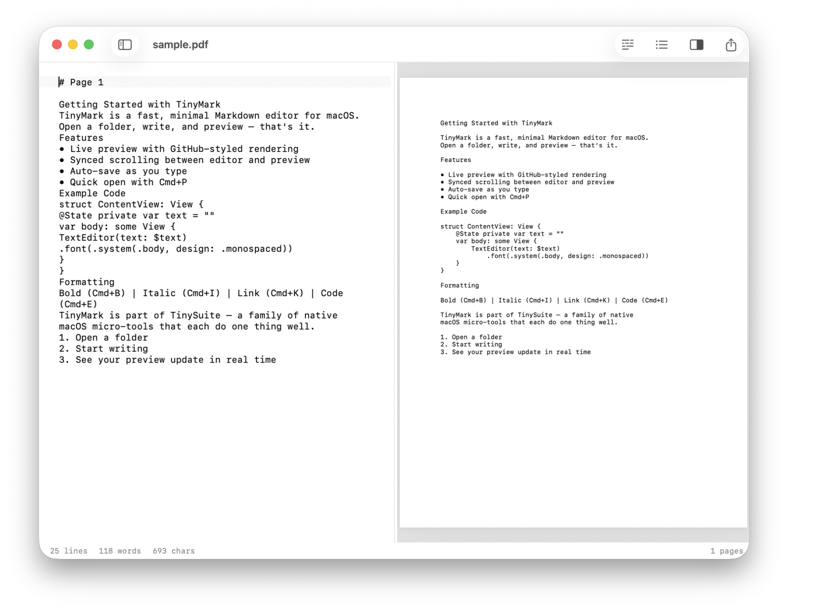

# TinyPDF

A native macOS PDF text extractor. See pages and extracted text side by side. Runs OCR on scans automatically. Export to Markdown.




## Features

- **Side-by-side layout** — extracted text alongside the rendered PDF pages
- **Text extraction** — automatic page-by-page text with `# Page N` headers
- **Built-in OCR** — scanned and image-based PDFs via Apple's Vision framework
- **Export as Markdown** — save extracted text as `.md` with Cmd+S
- **Continuous scroll** — PDF preview with auto-zoom
- **Directory browsing** — navigate folders, subdirectories, and files
- **Quick open** — fuzzy file finder (Cmd+P)
- **Line numbers** — optional gutter with current line highlight
- **Word wrap** — toggle with Opt+Z
- **Font size control** — Cmd+/Cmd- to adjust, Cmd+0 to reset
- **Multiple windows** — each window has independent state
- **Light & dark mode** — follows system appearance
- **On-device AI** — Cmd+K to ask questions about your document (CoreML, fully offline)
- **Open from Finder** — double-click `.pdf` files to open in TinyPDF

## Requirements

- macOS 26.0+
- Xcode 26+ (to build)

## Build

```bash
xcodegen generate --spec project.yml

xcodebuild clean build \
  -project TinyPDF.xcodeproj \
  -scheme TinyPDF \
  -configuration Release \
  -derivedDataPath /tmp/tinybuild/tinypdf \
  CODE_SIGN_IDENTITY="-"

rm -rf /Applications/TinyPDF.app
cp -R /tmp/tinybuild/tinypdf/Build/Products/Release/TinyPDF.app /Applications/
xattr -cr /Applications/TinyPDF.app
```

## Keyboard Shortcuts

| Shortcut | Action |
|---|---|
| Cmd+O | Open file |
| Cmd+Shift+O | Open folder |
| Cmd+S | Export as Markdown |
| Cmd+P | Quick open |
| Cmd+K | AI assistant |
| Cmd+Shift+N | New window |
| Cmd+= / Cmd+- | Font size |
| Cmd+0 | Reset font size |
| Opt+Z | Toggle word wrap |
| Opt+P | Toggle PDF preview |
| Opt+L | Toggle line numbers |

## Tech

Built with SwiftUI, NSTextView, PDFKit, Vision (OCR), and TinyKit.

## Part of [TinySuite](https://tinysuite.app)

Native macOS micro-tools that each do one thing well.

| App | What it does |
|-----|-------------|
| [TinyMark](https://github.com/michellzappa/tinymark) | Markdown editor with live preview |
| [TinyTask](https://github.com/michellzappa/tinytask) | Plain-text task manager |
| [TinyJSON](https://github.com/michellzappa/tinyjson) | JSON viewer with collapsible tree |
| [TinyCSV](https://github.com/michellzappa/tinycsv) | Lightweight CSV/TSV table viewer |
| **TinyPDF** | PDF text extractor with OCR |
| [TinyLog](https://github.com/michellzappa/tinylog) | Log viewer with level filtering |
| [TinySQL](https://github.com/michellzappa/tinysql) | Native PostgreSQL browser |

## License

MIT
